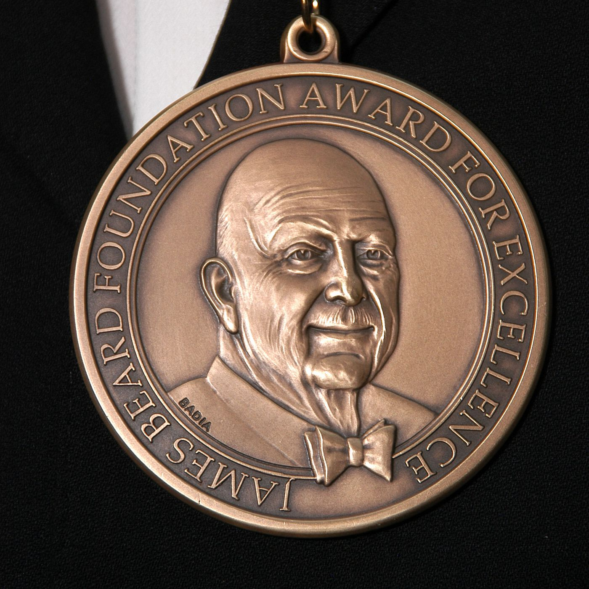

# James Beard Award

a repo for James Beard Award data

- All data and information is from : https://www.jamesbeard.org/

## About James Beard

James Beard laid the groundwork for the food revolution that has put America at the forefront of global gastronomy. He was a pioneer foodie, host of the first food program on the fledgling medium of television in 1946 [...]. James Andrew Beard was born on May 5, 1903, in Portland, Oregon, to Elizabeth and John Beard. He studied briefly at Reed College in Portland, Oregon, in 1923, but was expelled. Reed claimed it was due to poor scholastic performance, but Beard maintained it was due to his homosexuality. In 1937, Beard finally realized that his future lay in the world of food and cooking.

In 1940, Beard penned what was then the first major cookbook devoted exclusively to cocktail food, Hors d’Oeuvre & Canapés. Between 1945 and 1955 he wrote several seminal cookbooks, he appeared in his own segment on television’s first cooking show on NBC in 1946. In 1955, Beard established the James Beard Cooking School. 

When James Beard died at 81 on January 21, 1985, he left a legacy of culinary excellence and integrity to generations of home cooks and professional chefs. His name remains synonymous with American food.

## What are the James Beard Foundation Awards?

The James Beard Foundation Awards, a.k.a. the Beard Awards, are the food industry’s highest honor. Awards are given in many categories, including chefs and restaurants, books, journalism, broadcast media, and restaurant design and graphics, as well as for special achievements. Time magazine called them “the Oscars of the food world.”

## What do James Beard Foundation Award winners receive?

Bragging rights, a handsome medal, an impressive certificate, a lot of publicity, and the satisfaction of having been recognized by your peers. There are no cash awards.

